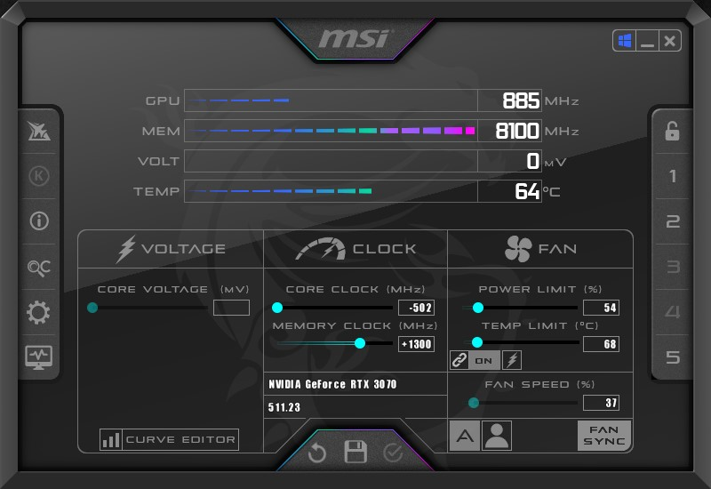
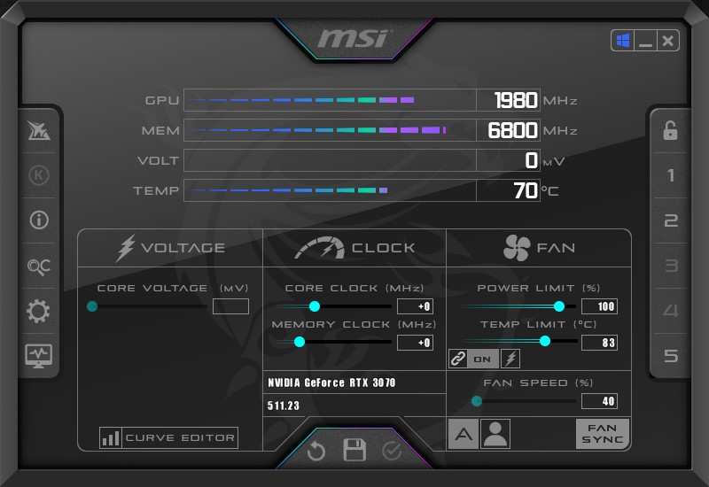

# T-REX with Windows Task Scheduler

## MSI Afterburner

Create your profiles from the GUI application.

Here:
- __Profile 1__ is the optimized settings
- __Profile 5__ is the default settings

### Profile 1

```
GPU #0: RTX 3070 - 59.18 MH/s, [T:63C, P:118W, F:38%, E:501kH/W]
```



### Profile 5

Default settings



## Adapt Scripts

Edit `start_t-rex.bat` and `stop_t-rex.bat` then adapt:

- paths
- profiles
- t-rex.exe command arguments

## Windows Task Scheduler

Open **CMD** with **admin rights** and create the following tasks:

```
schtasks /create /sc daily /tn "T-REX\START" /tr "E:\DEV\t-rex-win-task-scheduler\start_t-rex.bat" /st 23:45 /rl highest /it

schtasks /create /sc daily /tn "T-REX\STOP" /tr "E:\DEV\t-rex-win-task-scheduler\stop_t-rex.bat" /st 06:45 /rl highest /it
```

Note: if the `/it` argument is not set MSI Afterburner profile switching seems not working.

## Tests

1. Open **MSI Afterburner** application
2. Open Windows **Task Manager** GUI
3. Open Windows **Task Scheduler** GUI and go to **T-REX** folder
4. Execute `START` task
   - MSI Afterburner => profile switching
   - Task Manager => GPU utilization 99%
5. Execute `STOP` task
   - MSI Afterburner => profile switching
   - Task Manager => GPU utilization 0%
